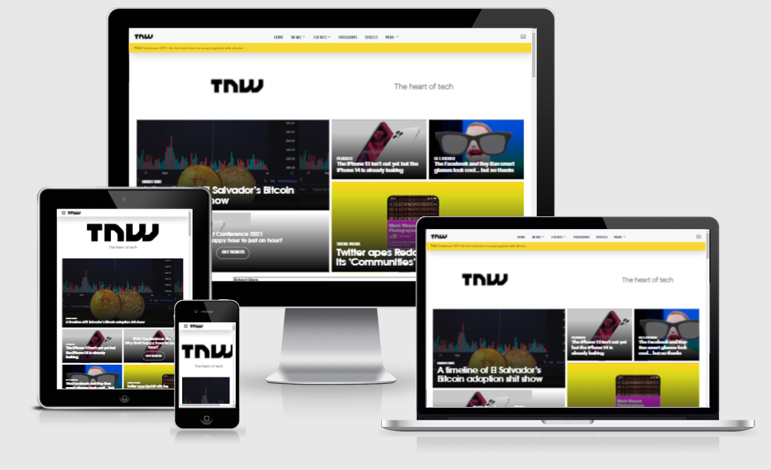

# Building With Responsive Design || The Odin Project

> This is a project idea gotten from theOdinProject - Full stack curriculum. It is a clone of the next web home page.



## Built With

- Pure HTML5 and CSS3
- No framework is used
- Deployed with Netlify

## Live Demo

[Live Demo Link](https://responsivenextweb.netlify.app/)

### Development (Running locally)

- Clone the project

```bash
git clone https://https://github.com/MrTaaJ/TheNextWeb.git

```

- Install Dependencies

```bash
npm install i
```

To run StyleLint by itself, you may run the lint task:

```bash
npm run lint:check
```

Or to automatically fix issues found (where possible):

```bash
npm run lint
```

You can also check against Prettier:

```bash
npm run format:check
```

and to have it actually fix (to the best of its ability) any format issues, run:

```bash
npm run format
```

You can also check against HTML Validator:

```bash
npm run html-validator
```

## 👤 Author

- Github: [@mrtaaj](https://github.com/mrtaaj)
- Twitter: [@seedof_99](https://twitter.com/seedof_99)

## 🤝 Contributing

Contributions, issues and feature requests are welcome!

## Show your support

Give a ⭐️ if you like this project!

## Acknowledgments

- A very big thank you to @adejam for his support and encouragement

## 📝 License

[MIT licensed](./LICENSE).
